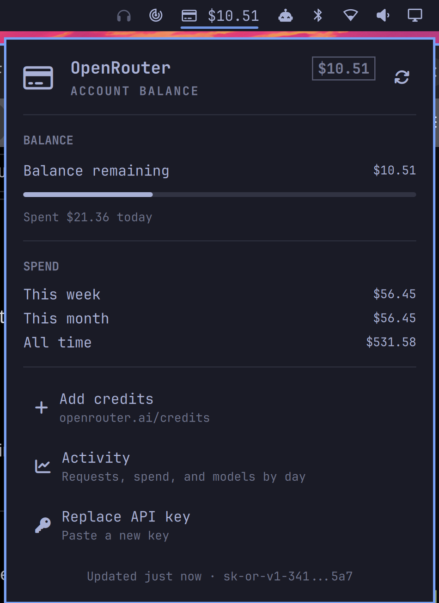

# Omarchy.OpenRouter

An [Omarchy](https://omarchy.org/) shell plugin: remaining OpenRouter credit
in the bar, and the ledger behind it in a popup: what was purchased against
the balance, what this key is capped at, and what has been spent today, this
week, and this month.

```
  $74.75
```



## Install

```bash
git clone https://github.com/SpoilHeap/Omarchy.OpenRouter.git ~/.config/omarchy/plugins/io.github.spoilheap.openrouter
omarchy plugin enable io.github.spoilheap.openrouter
omarchy restart shell
```

## What the figure is

OpenRouter answers "how much is left" from three different endpoints, and
which ones a key may read depends on the key:

| Endpoint | Needs | Gives |
|---|---|---|
| `/api/v1/credits` | usually a management key | the account ledger: credits purchased and credits used |
| `/api/v1/key` | any inference key | this key's spend cap and its own lifetime spend |
| `/api/v1/activity` | a management key | account-wide spend by day, for the last 30 days |

All three are asked on every refresh and whichever answers, answers. The hero
line names the figure being shown so the panel never leaves it ambiguous:

- **Account balance** — purchased minus used, the real remaining credit.
- **Key spend cap** — no management key, but this key has a cap, so what is
  left of the cap is the honest answer.
- **Spend only** — no management key and an uncapped key. There is no
  remaining figure to give, so the panel shows spend and says why.

The meter under the balance shows how much of *today's* starting balance is
left, so it moves day to day instead of sitting pinned near-empty for the
rest of a long-funded account's life. Today's spend can't come from
`/api/v1/activity` — that endpoint only reports on UTC days once they're
over, and refuses to say anything about the one in progress — so instead the
widget records the account's lifetime spend the first time it polls each UTC
day, to a small state file (`~/.config/omarchy/openrouter/today-spend.json`),
and every later poll that day is that much spend since. This needs
`/api/v1/credits`, which usually needs a management key; without one the
meter falls back to the lifetime purchased-vs-spent ratio instead. The SPEND
section's week and month rows add today's live figure on top of whatever
`/api/v1/activity` has already settled for the earlier days in the window —
that also needs a management key, and says so when it's missing. A
management key is free to create at
[openrouter.ai/settings/management-keys](https://openrouter.ai/settings/management-keys)
and, unlike an inference key, cannot itself make chat requests — so it can be
pasted into this widget without being able to run up a bill on its own.

Because today's spend is tracked from the moment this widget first records a
baseline, whatever was spent earlier that same day — before the baseline
existed — isn't in it. The figure is accurate from install onward, not
retroactively.

## The API key

Checked in this order, first hit wins:

1. the `keyCommand` setting, for a secret manager
2. `$OPENROUTER_API_KEY`, then `$OPENROUTER_KEY`
3. `~/.config/omarchy/openrouter/key`
4. `~/.config/openrouter/key`

The easiest way in is the panel itself: with no key found, it shows a field
to paste one into. Save it (Enter, or the check icon) and the widget writes
it straight to `~/.config/omarchy/openrouter/key` and refreshes. Once a key
is on file, the same field reappears from the "Replace API key" action if
you ever need to swap it.

Editing the file by hand works just as well:

```bash
$EDITOR ~/.config/omarchy/openrouter/key
chmod 600 ~/.config/omarchy/openrouter/key
```

Out of a secret manager instead, with no key on disk:

```bash
omarchy bar set io.github.spoilheap.openrouter keyCommand 'pass show openrouter/api-key'
```

Keys come from [openrouter.ai/settings/keys](https://openrouter.ai/settings/keys).
For the account balance rather than a key cap, that has to be a management key.

The key never reaches a command line at any point: typed input goes over
stdin to `save-key.sh`, which writes it with mode 600; `credits.sh` likewise
hands it to curl through a config file on stdin. Neither appears in `ps` or
in argv. When `keyCommand` or an environment variable is set, that source
takes precedence over the file and the panel says so — a key saved from the
UI in that case is written to the file but won't be used until the
higher-priority source is unset.

## Uninstall

```bash
omarchy plugin disable io.github.spoilheap.openrouter
rm -rf ~/.config/omarchy/plugins/io.github.spoilheap.openrouter
omarchy restart shell
```

That removes the plugin's own checkout, but not the API key: it's written to
`~/.config/omarchy/openrouter/`, outside the checkout, so a saved key survives
a reinstall. To also remove the key and the today's-spend state file:

```bash
rm -rf ~/.config/omarchy/openrouter
```

If the key came from `keyCommand` or an environment variable instead of the
file, clear that too — it isn't touched by either command above.

## Interactions

- **Bar icon** — left: panel · right: refresh without opening · middle: top-up page
- **Panel** — `j`/`k` move the cursor, Enter activates it (or refreshes when
  nothing is selected), `r` refresh, `t` top up, `a` activity, Tab moves to the
  neighboring bar panel, Esc closes
- **IPC** — `omarchy-shell io.github.spoilheap.openrouter <open|close|toggle|refresh|status|remaining>`

```bash
$ omarchy-shell io.github.spoilheap.openrouter status
Account balance: $74.75
```

## Settings

In this widget's entry in `~/.config/omarchy/shell.json`, or via
`omarchy bar set io.github.spoilheap.openrouter <key> <value>`:

| Key | Default | What it does |
|---|---|---|
| `refreshIntervalSec` | `300` | How often OpenRouter is asked |
| `lowBalance` | `5` | Turn the bar figure urgent at or below this many credits |
| `barLabel` | `"Amount"` | `"Icon only"` keeps the bar to the icon alone |
| `keyCommand` | `""` | Shell command that prints the key |

Numbers need `--json`, or they land in `shell.json` as strings:

```bash
omarchy bar set io.github.spoilheap.openrouter refreshIntervalSec 900 --json
omarchy bar set io.github.spoilheap.openrouter lowBalance 10 --json
omarchy bar set io.github.spoilheap.openrouter barLabel 'Icon only'
```

A vertical bar has no room for a figure and falls back to the icon on its own,
whatever `barLabel` says.

## Files

| File | What it is |
|---|---|
| `manifest.json` | plugin declaration and settings schema |
| `Panel.qml` | the bar button and the popup |
| `Service.qml` | runs the helper on a timer, holds the result |
| `Model.js` | formatting — money, ages, section wording |
| `credits.sh` | resolves the key, asks OpenRouter, prints one JSON object |
| `save-key.sh` | writes a key pasted into the panel to the key file, over stdin |

`credits.sh` also keeps `~/.config/omarchy/openrouter/today-spend.json`, its
baseline for today's spend — safe to delete; it's just rebuilt on the next poll.

`credits.sh` always exits 0 with JSON, so a refused key or an unreachable API
is a state the panel renders rather than an error it swallows. It can be run
by hand to see exactly what the widget sees:

```bash
bash ~/.config/omarchy/plugins/io.github.spoilheap.openrouter/credits.sh | jq .
```

Editing any file here reloads the plugin. If a change does not take —
QML that is already loaded can hold on — force it with
`omarchy restart shell`.
